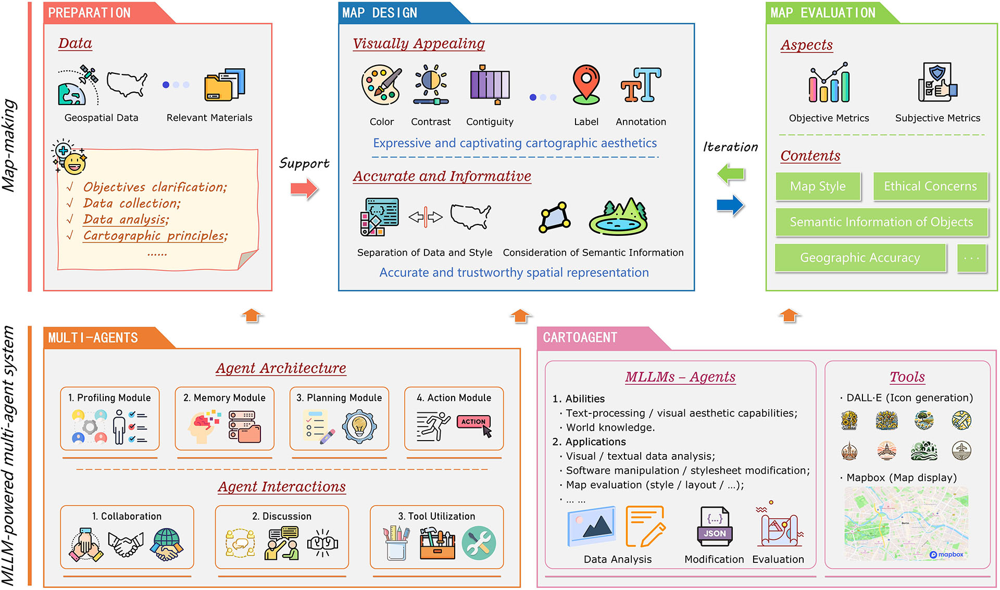

# 🗺️ CartoAgent: Map Style Transfer and Evaluation


Welcome to the official repository for our work **"CartoAgent: a multimodal large language model-powered multi-agent cartographic framework for map style transfer and evaluation"**!

## 📚 Table of Contents

* [About The Project](#🌟-About-The-Project)
* [Folder Structure](#📁-Folder-Structure)

* [Future Directions](#🚀-Future-Directions)
* [Contact](#📫-Contact)
* [Citation](#📖-Citation)

## 🌟 About The Project



The rapid development of generative artificial intelligence (GenAI) presents new opportunities to advance the cartographic process. Previous studies have either overlooked the artistic aspects of maps or faced challenges in creating both accurate and informative maps. In this study, we propose CartoAgent, a novel multi-agent cartographic framework powered by multimodal large language models (MLLMs). This framework simulates three key stages in cartographic practice: preparation, map design, and evaluation. At each stage, different MLLMs act as agents with distinct roles to collaborate, discuss, and utilize tools for specific purposes. In particular, CartoAgent leverages MLLMs’ visual aesthetic capability and world knowledge to generate maps that are both visually appealing and informative. By separating style from geographic data, it can focus on designing stylesheets without modifying the vector-based data, thereby ensuring geographic accuracy. As a result, the proposed CartoAgent could effectively produce maps that are not only visually appealing but also accurate and informative. We applied it to a specific task centered on map restyling, namely, map style transfer and evaluation. The effectiveness of this framework was validated through extensive experiments and a human evaluation study. CartoAgent can be extended to support a variety of cartographic design decisions and inform future integrations of GenAI in cartography.

## 📁 Folder Structure


This repository provides the official Python implementation of CartoAgent, along with teaching materials developed for the Cartography & Maps course at UT Austin. For detailed instructions on how to use the code, please refer to the [README](./research/README.md) file.

| Path                                        | Description                |
| ------------------------------------------- | -------------------------- |
| ./research                                  | Source code for CartoAgent |
| ./teaching                                  | Teaching materials         |
| ./teaching/Spring25-Lab7-GRG356-CartoAI.pdf | Lecture slides             |
| ./teaching/Lab7PromptTutorial.docx          | Prompt design tutorial     |
| ./teaching/Lab7Data                         | Dataset                    |

## 🚀 Future Directions

We aim to extend CartoAgent in several directions:

- 🌐 Support for diverse platforms (e.g., QGIS, Google Maps);
- 🧠 Integration with image generation models (e.g., DALL·E) for generative icons.

## 📫 Contact

For questions, feedback, or collaboration inquiries, feel free to:

- Open an Issue;
- Or reach out to the maintainers directly at:
- Chenglong Wang: chenglongw@stu.pku.edu.cn  
- Yuhao Kang: yuhao.kang@austin.utexas.edu

## 📖 Citation

If you use any materials in your research, teaching, or applications, please cite this source:

Wang, C., Kang, Y., Gong, Z., Zhao, P., Feng, Y., Zhang, W. and Li, G., 2025. CartoAgent: a multimodal large language model-powered multi-agent cartographic framework for map style transfer and evaluation. *International Journal of Geographical Information Science*, pp.1-34. [https://www.tandfonline.com/doi/abs/10.1080/13658816.2025.2507844](https://www.tandfonline.com/doi/abs/10.1080/13658816.2025.2507844)

```
@article{wang2025cartoagent,
  title={CartoAgent: a multimodal large language model-powered multi-agent cartographic framework for map style transfer and evaluation},
  author={Wang, Chenglong and Kang, Yuhao and Gong, Zhaoya and Zhao, Pengjun and Feng, Yu and Zhang, Wenjia and Li, Ge},
  journal={International Journal of Geographical Information Science},
  pages={1--34},
  year={2025},
  publisher={Taylor \& Francis}
}
```

Or read the preprint version on [Arxiv](https://arxiv.org/abs/2505.09936). 
