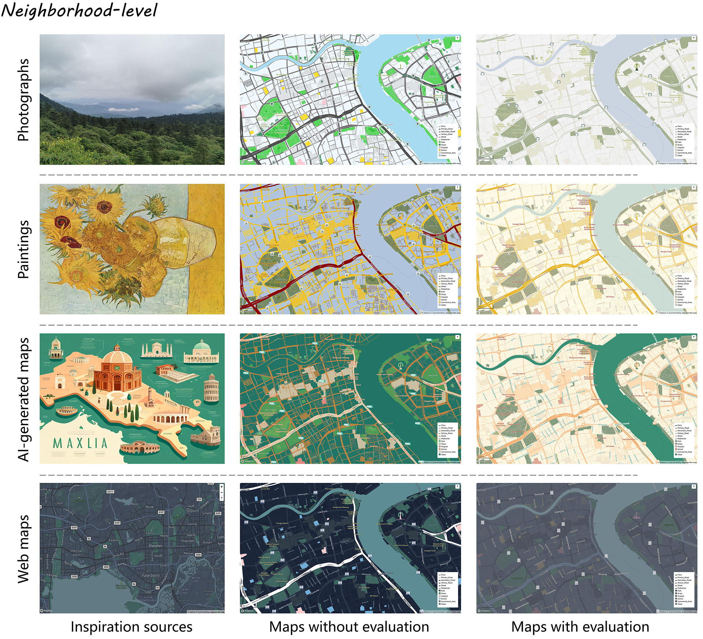
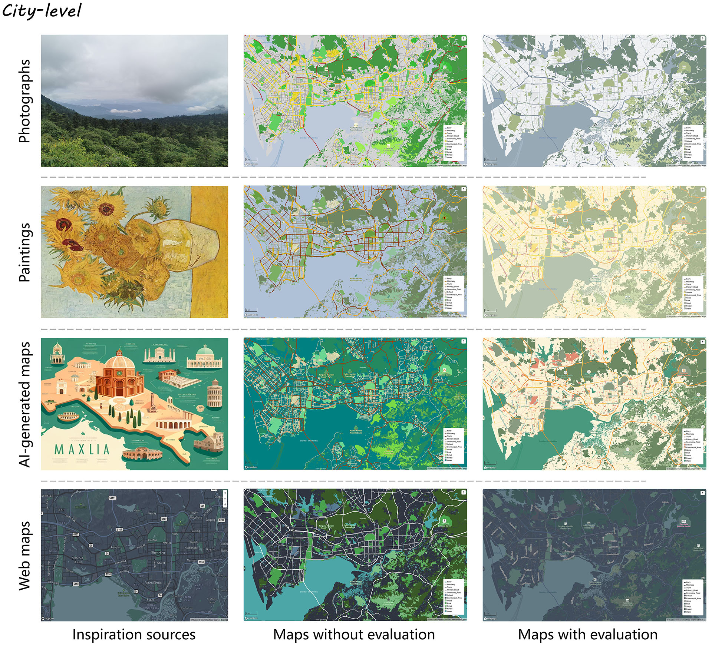
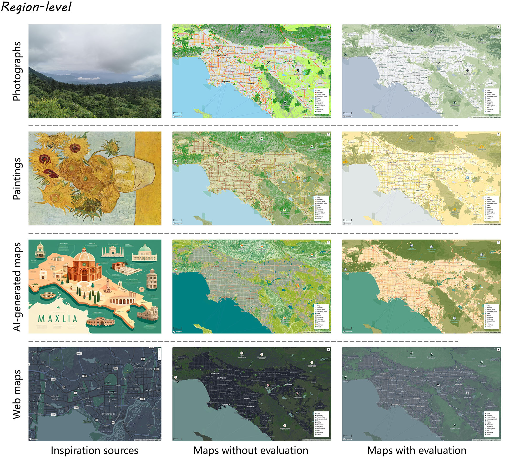

## 📦 Setup

Clone the repository and install required packages:

```bash
pip install openai
```

## 🛠️ Requirements

| Dependency | Description                               |
| ---------- | ----------------------------------------- |
| Openai     | Access to GPT-4o or similar MLLM endpoint |
| Mapbox     | Mapbox access token and username          |

## 🚀 Usage

To run a map style transfer and evaluation task, use the following command:

```bash
python map_style_transfer.py \
  --api_key <your_openai_api_key> \
  --mapbox_token <your_mapbox_token> \
  --mapbox_username <your_mapbox_username> \
  --inspiration_path ./data/inspiration.png \
  --map_data_path ./data/map_data_shanghai.json
```

This command will:

1. Encode the reference image.
2. Generate a Mapbox-compatible style specification based on the inspiration.
3. Render the map with the new style.
4. Evaluate the result with a reviewer agent.







## 📁 Repository Structure

| Path                            | Description                                                  |
| ------------------------------- | ------------------------------------------------------------ |
| ./data/inspiration.png          | Input image for map style inspiration (e.g., historical map or painting) |
| ./data/map_data_shanghai.json   | Input Mapbox style or vector tile schema                     |
| ./map_style_transfer.py         | Main entry script for style transfer pipeline                |
| ./utils/prompt.py               | Prompt templates for the three agents: appreciator, designer, reviewer |
| ./results/                      | Output folder for styled maps, logs, and evaluation results  |
| ./results/log.txt               | Dialogue history between agents                              |
| ./results/{style_name}_{id}.png | Output styled map image                                      |
